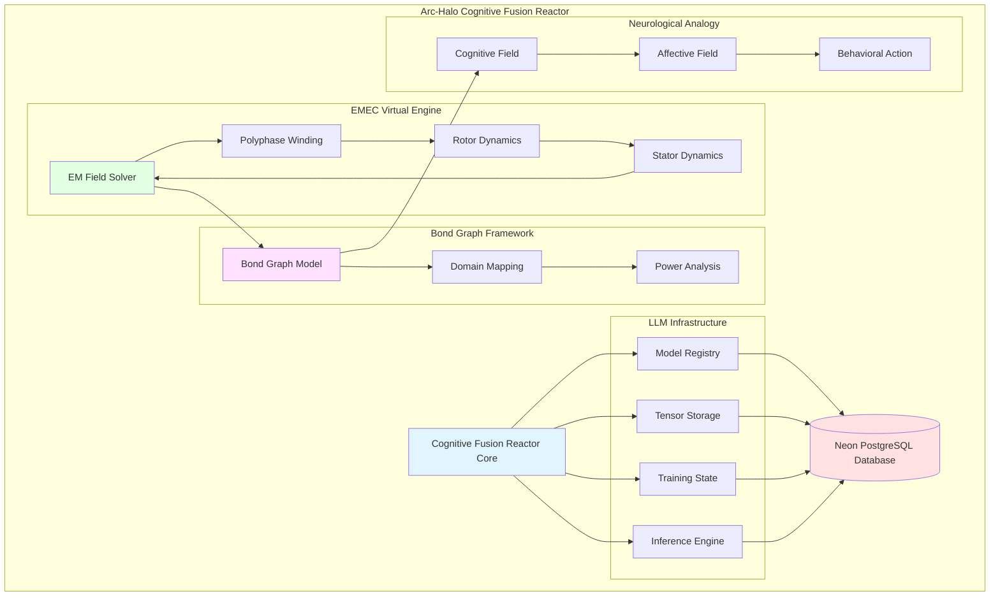
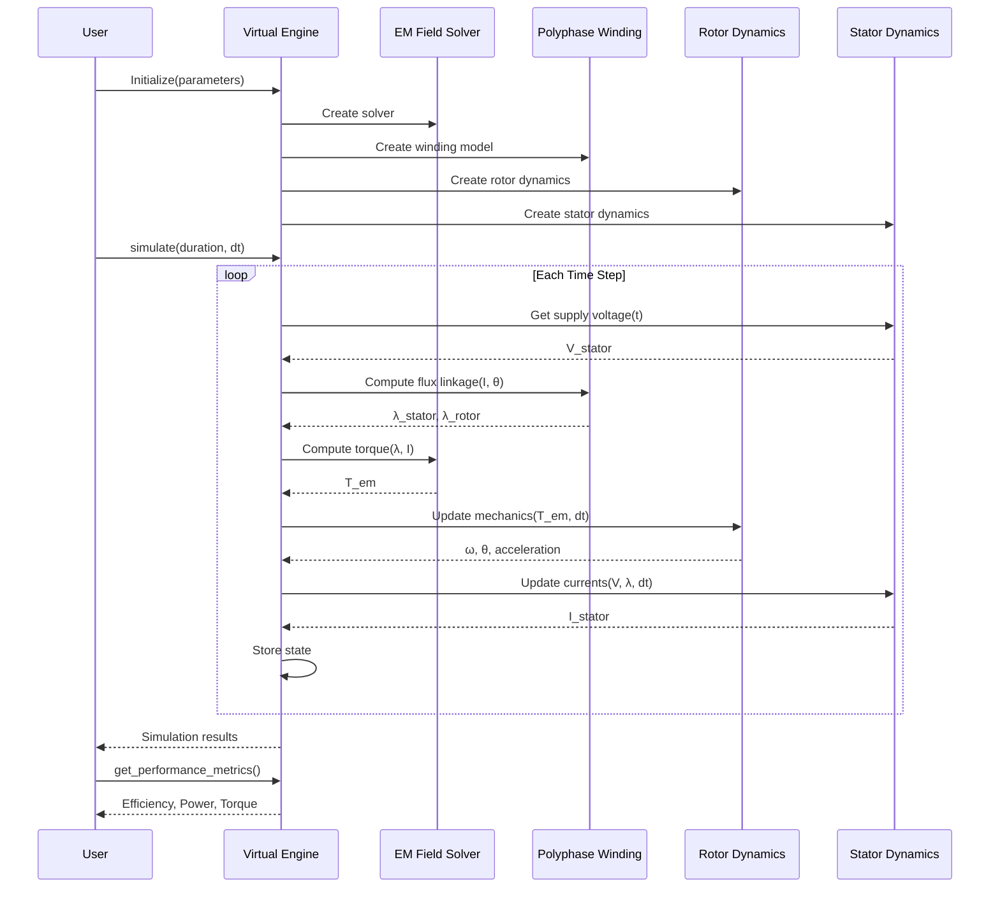
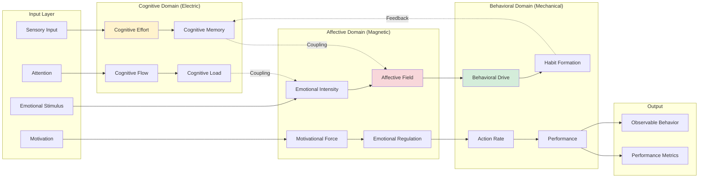
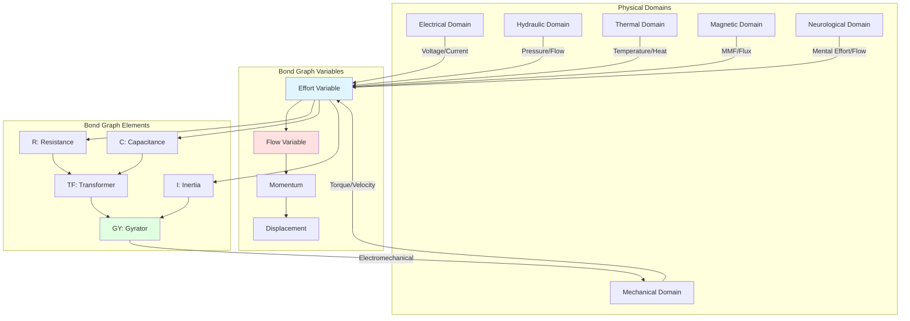
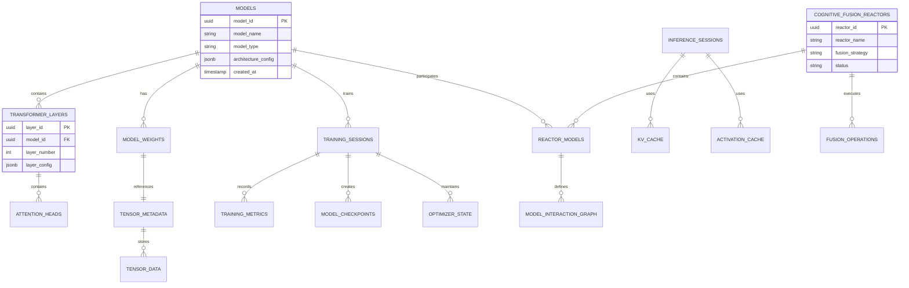
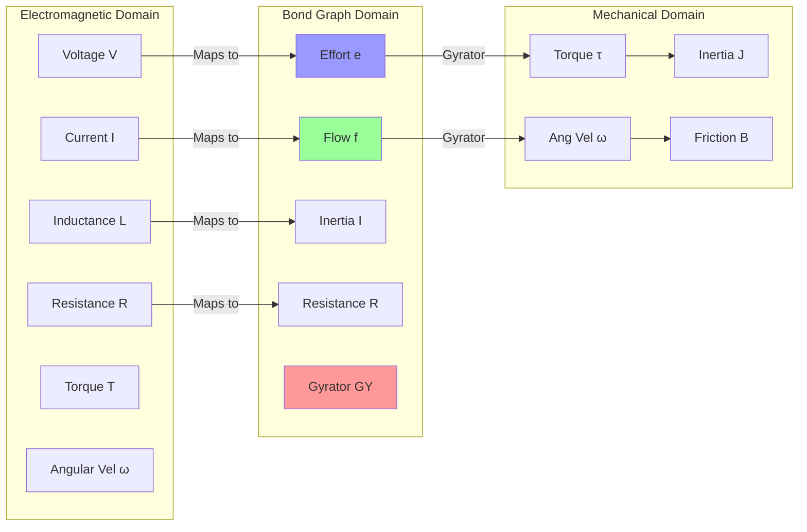
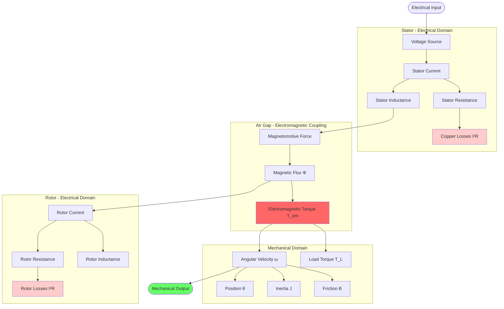

# Arc-Halo Cognitive Fusion Reactor - Technical Architecture Specification

## Document Overview

This document provides comprehensive technical architecture documentation for the Arc-Halo Cognitive Fusion Reactor and EMEC (Electromagnetic Energy Conversion) system, including:

- Cross-section diagrams of rotor/stator electromagnetic interaction
- Complete electromagnetic field equations
- Mermaid-based architecture diagrams
- Formal Z++ specifications
- System integration and data flow diagrams

---

## 1. Rotor/Stator Cross-Section with EM Field Equations

### 1.1 Physical Cross-Section Diagram

```
                    INDUCTION MOTOR CROSS-SECTION
                    
                        ╔═════════════════════════════╗
                        ║    STATOR CORE (Fe-Si)     ║
                        ╠═════════════════════════════╣
                        ║                             ║
    ┌─────────────────────────────────────────────────────────┐
    │                                                           │
    │  Phase A Winding  ╔═══╗  ╔═══╗  ╔═══╗                   │
    │  (Copper)         ║   ║  ║   ║  ║   ║                   │
    │                   ╚═══╝  ╚═══╝  ╚═══╝                   │
    │                                                           │
    │                 ┌───────────────────┐                    │
    │                 │   AIR GAP (δ)     │                    │
    │   B-field  ──►  │   ~ 0.5-2.0 mm    │  ◄── Flux Φ      │
    │   Lines         └───────────────────┘                    │
    │                                                           │
    │       ╔════════════════════════════════════╗             │
    │       ║        ROTOR CORE (Fe-Si)         ║             │
    │       ║                                    ║             │
    │       ║  ┌──┐  ┌──┐  ┌──┐  ┌──┐  ┌──┐   ║             │
    │       ║  │██│  │██│  │██│  │██│  │██│   ║  Squirrel   │
    │       ║  └──┘  └──┘  └──┘  └──┘  └──┘   ║  Cage Bars  │
    │       ║         (Aluminum/Copper)         ║             │
    │       ║                                    ║             │
    │       ║         ┌────────┐                 ║             │
    │       ║         │ SHAFT  │                 ║             │
    │       ║         └────────┘                 ║             │
    │       ╚════════════════════════════════════╝             │
    │                                                           │
    │                       ω_r (rotation)                      │
    │                       θ_r (position)                      │
    └─────────────────────────────────────────────────────────┘

    ELECTROMAGNETIC FIELD DISTRIBUTION:
    
    ┌─────────────────────────────────────────────────────────┐
    │                                                           │
    │   Stator MMF:   F_s(θ, t) = N_s I_s cos(ωt - θ)        │
    │   Rotor MMF:    F_r(θ, t) = N_r I_r cos(ωt - pθ_r - θ)  │
    │                                                           │
    │   Resultant Flux Density:                                │
    │   B(θ, t) = B_max cos(ω_s t - pθ)                       │
    │                                                           │
    │   Air Gap Flux:                                          │
    │   Φ_g = ∫∫ B·dA = B_max · A_pole                        │
    │                                                           │
    └─────────────────────────────────────────────────────────┘
```

### 1.2 Maxwell's Equations for Rotating Machines

#### Faraday's Law of Induction
```
∇ × E = -∂B/∂t

In integral form:
∮ E·dl = -d/dt ∫∫ B·dA

For stator winding:
v_induced = -N dΦ/dt = -N d/dt(∫∫ B·dA)
```

#### Ampere's Law with Maxwell's Addition
```
∇ × H = J + ∂D/∂t

In integral form:
∮ H·dl = ∫∫ (J + ∂D/∂t)·dA

For air gap:
H·l_gap = N·I
B = μ₀·μ_r·H
```

#### Gauss's Law for Magnetism
```
∇·B = 0

Magnetic flux is conserved:
∮∮ B·dA = 0
```

#### Gauss's Law for Electricity
```
∇·D = ρ

In conductors at steady state:
∇·J = 0 (continuity)
```

### 1.3 Electromagnetic Torque Production

```
TORQUE GENERATION MECHANISM:

         Stator Field (B_s)
              ↓↓↓
    ╔═══════════════════════════╗
    ║                           ║
    ║    ┌─────────────────┐    ║
    ║    │                 │    ║
    ║    │   Rotor Bars    │←───║─── Induced Current (I_r)
    ║    │   (Conductor)   │    ║
    ║    │                 │    ║
    ║    └─────────────────┘    ║
    ║            ↓               ║
    ║         F = I × B          ║
    ║         (Lorentz Force)    ║
    ║            ↓               ║
    ║      Torque = r × F        ║
    ╚═══════════════════════════╝

Electromagnetic Torque Equation:
T_em = (3/2) · p · (λ_d·i_q - λ_q·i_d)

Where:
- p = pole pairs
- λ_d, λ_q = flux linkages in d-q frame
- i_d, i_q = currents in d-q frame
```

---

## 2. Complete System Architecture with Mermaid Diagrams

### 2.1 High-Level System Architecture



### 2.2 EMEC Virtual Engine Data Flow



### 2.3 Cognitive Fusion Reactor Architecture



### 2.4 Bond Graph Energy Domain Mapping



### 2.5 Database Schema Architecture



---

## 3. Formal Z++ Specification

### 3.1 Basic Type Definitions

```z++
┌─ SystemTypes ─────────────────────────────────────────────────┐
│                                                                │
│  [ModelID, TensorID, SessionID, ReactorID]                    │
│                                                                │
│  Status ::= active | inactive | training | inference          │
│  FusionStrategy ::= ensemble | hierarchical | cascade         │
│                                                                │
│  Vector == seq ℝ                                              │
│  Matrix == seq (seq ℝ)                                        │
│  Tensor == seq Matrix                                         │
│                                                                │
└────────────────────────────────────────────────────────────────┘

┌─ PhysicalConstants ───────────────────────────────────────────┐
│                                                                │
│  μ₀ : ℝ              /* Permeability of free space */        │
│  ε₀ : ℝ              /* Permittivity of free space */        │
│  c : ℝ               /* Speed of light */                     │
│                                                                │
│  μ₀ = 4 × π × 10⁻⁷                                           │
│  ε₀ = 8.854 × 10⁻¹²                                          │
│  c² = 1/(μ₀ × ε₀)                                            │
│                                                                │
└────────────────────────────────────────────────────────────────┘
```

### 3.2 Electromagnetic Field Specification

```z++
┌─ EMFieldState ────────────────────────────────────────────────┐
│                                                                │
│  B : Vector          /* Magnetic flux density [T] */          │
│  E : Vector          /* Electric field [V/m] */               │
│  H : Vector          /* Magnetic field [A/m] */               │
│  J : Vector          /* Current density [A/m²] */             │
│  t : ℝ               /* Time [s] */                           │
│                                                                │
│  /* Maxwell's Equations Constraints */                        │
│  ∇ × E = -∂B/∂t                                              │
│  ∇ × H = J + ∂D/∂t                                           │
│  ∇ · D = ρ                                                   │
│  ∇ · B = 0                                                   │
│                                                                │
│  /* Constitutive Relations */                                 │
│  B = μ × H                                                    │
│  D = ε × E                                                    │
│  J = σ × E                                                    │
│                                                                │
└────────────────────────────────────────────────────────────────┘

┌─ MaxwellSolver ───────────────────────────────────────────────┐
│  EMFieldState                                                  │
│                                                                │
│  SolveTimeStep                                                 │
│  ΔEMFieldState                                                 │
│  dt? : ℝ                                                      │
│  current? : Vector                                             │
│  ω? : ℝ               /* Angular velocity */                  │
│                                                                │
│  dt? > 0                                                      │
│  B' = μ × (current? × geometry_factor)                        │
│  E' = J' / σ                                                  │
│  t' = t + dt?                                                 │
│                                                                │
└────────────────────────────────────────────────────────────────┘
```

### 3.3 Rotor-Stator Interaction Specification

```z++
┌─ RotorState ──────────────────────────────────────────────────┐
│                                                                │
│  θ : ℝ               /* Mechanical angle [rad] */             │
│  ω : ℝ               /* Angular velocity [rad/s] */           │
│  α : ℝ               /* Angular acceleration [rad/s²] */      │
│  J : ℝ               /* Moment of inertia [kg·m²] */          │
│                                                                │
│  θ ∈ [0, 2π)                                                  │
│  ω ≥ 0                                                        │
│  J > 0                                                        │
│                                                                │
└────────────────────────────────────────────────────────────────┘

┌─ StatorState ─────────────────────────────────────────────────┐
│                                                                │
│  V : Vector          /* Phase voltages [V] */                 │
│  I : Vector          /* Phase currents [A] */                 │
│  λ : Vector          /* Flux linkages [Wb] */                 │
│  R : ℝ               /* Resistance [Ω] */                     │
│                                                                │
│  #V = 3              /* Three-phase */                        │
│  #I = 3                                                       │
│  #λ = 3                                                       │
│  R > 0                                                        │
│                                                                │
│  /* Voltage equation */                                       │
│  V = R × I + dλ/dt                                           │
│                                                                │
└────────────────────────────────────────────────────────────────┘

┌─ ElectromagneticCoupling ─────────────────────────────────────┐
│  RotorState                                                    │
│  StatorState                                                   │
│  EMFieldState                                                  │
│                                                                │
│  p : ℕ               /* Pole pairs */                         │
│  T_em : ℝ            /* Electromagnetic torque [N·m] */       │
│                                                                │
│  /* Flux linkage computation */                               │
│  λ = L_ss × I_s + L_sr(θ) × I_r                              │
│                                                                │
│  /* Torque equation (d-q frame) */                            │
│  T_em = (3/2) × p × (λ_d × i_q - λ_q × i_d)                  │
│                                                                │
│  /* Equation of motion */                                     │
│  J × α = T_em - T_load - B × ω                                │
│                                                                │
└────────────────────────────────────────────────────────────────┘
```

### 3.4 Cognitive Fusion Reactor Specification

```z++
┌─ Model ───────────────────────────────────────────────────────┐
│                                                                │
│  model_id : ModelID                                            │
│  name : String                                                 │
│  type : String                                                 │
│  architecture : Architecture                                   │
│  weights : TensorID ↦ Tensor                                  │
│  status : Status                                               │
│                                                                │
│  dom weights ⊆ TensorID                                       │
│  status ∈ {active, inactive, training}                        │
│                                                                │
└────────────────────────────────────────────────────────────────┘

┌─ CognitiveFusionReactor ──────────────────────────────────────┐
│                                                                │
│  reactor_id : ReactorID                                        │
│  models : ℙ Model                                             │
│  strategy : FusionStrategy                                     │
│  interaction_graph : Model ↔ Model                            │
│  status : Status                                               │
│                                                                │
│  #models ≥ 2                                                  │
│  ∀ m₁, m₂ : models •                                          │
│    (m₁, m₂) ∈ interaction_graph ⇒                            │
│    CompatibleArchitectures(m₁, m₂)                            │
│                                                                │
└────────────────────────────────────────────────────────────────┘

┌─ FusionOperation ─────────────────────────────────────────────┐
│  CognitiveFusionReactor                                        │
│                                                                │
│  Fuse                                                          │
│  inputs? : seq Tensor                                          │
│  output! : Tensor                                              │
│                                                                │
│  #inputs? = #models                                           │
│                                                                │
│  strategy = ensemble ⇒                                        │
│    output! = Ensemble(inputs?)                                │
│                                                                │
│  strategy = hierarchical ⇒                                    │
│    output! = Hierarchical(inputs?, interaction_graph)         │
│                                                                │
│  strategy = cascade ⇒                                         │
│    output! = Cascade(inputs?, interaction_graph)              │
│                                                                │
└────────────────────────────────────────────────────────────────┘
```

### 3.5 Bond Graph Framework Specification

```z++
┌─ EnergyDomain ────────────────────────────────────────────────┐
│                                                                │
│  Domain ::= electrical | mechanical_rotation |                 │
│             mechanical_translation | hydraulic |                │
│             thermal | magnetic | neurological                  │
│                                                                │
└────────────────────────────────────────────────────────────────┘

┌─ PowerVariables ──────────────────────────────────────────────┐
│                                                                │
│  effort : ℝ          /* Generalized effort */                │
│  flow : ℝ            /* Generalized flow */                  │
│  momentum : ℝ        /* Generalized momentum */              │
│  displacement : ℝ    /* Generalized displacement */          │
│                                                                │
│  /* Power conservation */                                     │
│  power = effort × flow                                        │
│                                                                │
│  /* Integral relations */                                     │
│  momentum = ∫ effort dt                                       │
│  displacement = ∫ flow dt                                     │
│                                                                │
└────────────────────────────────────────────────────────────────┘

┌─ BondGraphElement ────────────────────────────────────────────┐
│  PowerVariables                                                │
│                                                                │
│  ElementType ::= R | C | I | TF | GY | SE | SF               │
│                                                                │
│  R_element:  effort = R × flow         /* Resistance */       │
│  C_element:  q = C × effort            /* Capacitance */      │
│  I_element:  p = I × flow              /* Inertia */          │
│  TF_element: e₁ = n × e₂, f₂ = n × f₁ /* Transformer */     │
│  GY_element: e₁ = r × f₂, e₂ = r × f₁ /* Gyrator */         │
│                                                                │
│  /* Power conservation for 2-port elements */                 │
│  e₁ × f₁ + e₂ × f₂ = 0                                       │
│                                                                │
└────────────────────────────────────────────────────────────────┘

┌─ DomainMapping ───────────────────────────────────────────────┐
│  EnergyDomain                                                  │
│  PowerVariables                                                │
│                                                                │
│  MapToGeneralized                                              │
│  domain? : Domain                                              │
│  physical_effort? : ℝ                                         │
│  physical_flow? : ℝ                                           │
│                                                                │
│  domain? = electrical ⇒                                       │
│    (effort = voltage ∧ flow = current)                        │
│                                                                │
│  domain? = mechanical_rotation ⇒                              │
│    (effort = torque ∧ flow = angular_velocity)                │
│                                                                │
│  domain? = neurological ⇒                                     │
│    (effort = mental_effort ∧ flow = cognitive_flow)           │
│                                                                │
└────────────────────────────────────────────────────────────────┘
```

### 3.6 Neurological Analogy Specification

```z++
┌─ CognitiveField ──────────────────────────────────────────────┐
│                                                                │
│  mental_effort : ℝ   /* Analogous to voltage */              │
│  cognitive_flow : ℝ  /* Analogous to current */              │
│  cognitive_load : ℝ  /* Analogous to resistance */           │
│  working_memory : ℝ  /* Analogous to capacitance */          │
│  cognitive_inertia : ℝ /* Analogous to inductance */         │
│                                                                │
│  /* Cognitive dynamics equation */                            │
│  mental_effort = cognitive_load × cognitive_flow +             │
│                 cognitive_inertia × d(cognitive_flow)/dt +     │
│                 working_memory⁻¹ × ∫ cognitive_flow dt        │
│                                                                │
└────────────────────────────────────────────────────────────────┘

┌─ AffectiveField ──────────────────────────────────────────────┐
│                                                                │
│  emotional_intensity : ℝ    /* Analogous to magnetic field */ │
│  motivational_force : ℝ     /* Analogous to MMF */           │
│  affective_flux : ℝ         /* Analogous to magnetic flux */ │
│  emotional_inertia : ℝ      /* Slow emotional changes */     │
│                                                                │
│  /* Affective dynamics */                                     │
│  affective_flux = f(motivational_force, emotional_state)      │
│  d(emotional_state)/dt = -emotional_regulation +               │
│                          emotional_stimulus                    │
│                                                                │
└────────────────────────────────────────────────────────────────┘

┌─ BehavioralAction ────────────────────────────────────────────┐
│                                                                │
│  behavioral_drive : ℝ    /* Analogous to torque */           │
│  action_rate : ℝ         /* Analogous to velocity */         │
│  habit_strength : ℝ      /* Analogous to inertia */          │
│  environmental_load : ℝ  /* Analogous to friction */         │
│                                                                │
│  /* Behavioral dynamics (Newton's law analog) */              │
│  habit_strength × d(action_rate)/dt =                         │
│      behavioral_drive - environmental_load × action_rate       │
│                                                                │
└────────────────────────────────────────────────────────────────┘

┌─ PsychophysicalCoupling ──────────────────────────────────────┐
│  CognitiveField                                                │
│  AffectiveField                                                │
│  BehavioralAction                                              │
│                                                                │
│  /* Cognitive-Affective coupling */                           │
│  affective_modulation = f(cognitive_flow, emotional_intensity) │
│                                                                │
│  /* Affective-Behavioral coupling */                          │
│  behavioral_drive = g(affective_flux, motivational_force)     │
│                                                                │
│  /* Behavioral-Cognitive feedback */                          │
│  performance_feedback = action_rate × task_success_rate        │
│  Δ(cognitive_load) = -η × performance_feedback                │
│                                                                │
│  /* Total system energy */                                    │
│  E_total = E_cognitive + E_affective + E_behavioral            │
│                                                                │
└────────────────────────────────────────────────────────────────┘
```

### 3.7 System Integration Specification

```z++
┌─ ArcHaloSystem ───────────────────────────────────────────────┐
│                                                                │
│  reactors : ℙ CognitiveFusionReactor                          │
│  engines : ℙ VirtualEngine                                    │
│  bond_graphs : ℙ BondGraphModel                               │
│  neuro_models : ℙ NeurologicalEnergyModel                     │
│  database : Database                                           │
│                                                                │
│  /* System invariants */                                       │
│  ∀ r : reactors • r.status ∈ {active, inactive}              │
│  ∀ e : engines • ValidEngineConfiguration(e)                  │
│  ∀ b : bond_graphs • PowerConserved(b)                        │
│  ∀ n : neuro_models • EnergyConserved(n)                      │
│                                                                │
└────────────────────────────────────────────────────────────────┘

┌─ SystemOperation ─────────────────────────────────────────────┐
│  ArcHaloSystem                                                 │
│                                                                │
│  Initialize                                                    │
│  config? : Configuration                                       │
│                                                                │
│  ValidConfiguration(config?)                                   │
│  reactors' = InitReactors(config?)                            │
│  engines' = InitEngines(config?)                              │
│  database' = ConnectDatabase(config?)                         │
│                                                                │
└────────────────────────────────────────────────────────────────┘

┌─ SimulationStep ──────────────────────────────────────────────┐
│  ΔArcHaloSystem                                               │
│                                                                │
│  dt? : ℝ                                                      │
│  inputs? : seq Tensor                                          │
│  outputs! : seq Tensor                                         │
│                                                                │
│  dt? > 0                                                      │
│                                                                │
│  /* Update all subsystems */                                   │
│  ∀ r : reactors • r' = StepReactor(r, inputs?, dt?)          │
│  ∀ e : engines • e' = StepEngine(e, dt?)                     │
│  ∀ b : bond_graphs • b' = StepBondGraph(b, dt?)              │
│  ∀ n : neuro_models • n' = StepNeuro(n, dt?)                 │
│                                                                │
│  outputs! = CollectOutputs(reactors', engines')                │
│                                                                │
└────────────────────────────────────────────────────────────────┘
```

### 3.8 Safety and Correctness Properties

```z++
┌─ SafetyProperties ────────────────────────────────────────────┐
│                                                                │
│  /* Energy conservation */                                     │
│  EnergyConserved: ∀ sys : ArcHaloSystem, t : ℝ •             │
│    E_total(t) = E_input(t) - E_output(t) - E_dissipated(t)   │
│                                                                │
│  /* Numerical stability */                                     │
│  NumericallyStable: ∀ state : SystemState •                   │
│    ‖state‖ < MAX_VALUE ∧                                     │
│    ∀ derivative : ℝ • |derivative| < MAX_DERIVATIVE          │
│                                                                │
│  /* Physical constraints */                                    │
│  PhysicallyValid: ∀ e : VirtualEngine •                       │
│    e.rotor.ω ≥ 0 ∧                                           │
│    ‖e.stator.I‖ < I_max ∧                                    │
│    |e.torque| < T_max                                         │
│                                                                │
│  /* Database consistency */                                    │
│  DatabaseConsistent: ∀ r : CognitiveFusionReactor •           │
│    (∀ m : r.models • ∃ record : database •                   │
│       record.model_id = m.model_id)                           │
│                                                                │
└────────────────────────────────────────────────────────────────┘

┌─ LivenessProperties ──────────────────────────────────────────┐
│                                                                │
│  /* Progress guarantee */                                      │
│  MakesProgress: ∀ sys : ArcHaloSystem, t : ℝ •               │
│    (sys.status = active) ⇒                                    │
│    ∃ t' : ℝ • t' > t ∧ StateChanged(sys, t, t')             │
│                                                                │
│  /* Convergence for steady state */                           │
│  ConvergesToSteadyState: ∀ e : VirtualEngine •                │
│    (constant_load(e) ∧ t → ∞) ⇒                              │
│    |e.rotor.α| → 0 ∧ |d(e.stator.I)/dt| → 0                 │
│                                                                │
│  /* Termination guarantee */                                   │
│  EventuallyTerminates: ∀ sim : Simulation •                   │
│    sim.start_time ≥ 0 ∧ sim.duration > 0 ⇒                   │
│    ∃ t_end : ℝ • t_end = sim.start_time + sim.duration ∧    │
│                  SimulationCompletes(sim, t_end)              │
│                                                                │
└────────────────────────────────────────────────────────────────┘
```

---

## 4. Performance Specifications

### 4.1 Computational Complexity

```z++
┌─ ComplexityBounds ────────────────────────────────────────────┐
│                                                                │
│  /* EM Field Solver */                                        │
│  TimeComplexity_EMSolver : O(n)                               │
│    where n = number of field points                           │
│                                                                │
│  /* Winding Model */                                          │
│  TimeComplexity_Winding : O(p²)                               │
│    where p = number of phases                                 │
│                                                                │
│  /* Virtual Engine Step */                                    │
│  TimeComplexity_EngineStep : O(p² + n)                        │
│                                                                │
│  /* Cognitive Fusion */                                       │
│  TimeComplexity_Fusion : O(m × d²)                            │
│    where m = number of models, d = hidden dimension           │
│                                                                │
│  SpaceComplexity_TensorStorage : O(l × d² × b)                │
│    where l = layers, d = dimension, b = batch size            │
│                                                                │
└────────────────────────────────────────────────────────────────┘
```

### 4.2 Real-Time Performance Requirements

```z++
┌─ PerformanceRequirements ─────────────────────────────────────┐
│                                                                │
│  /* Simulation time step */                                   │
│  MIN_TIME_STEP = 1.0 × 10⁻⁵ s                                │
│  MAX_TIME_STEP = 1.0 × 10⁻³ s                                │
│  RECOMMENDED_TIME_STEP = 1.0 × 10⁻⁴ s                         │
│                                                                │
│  /* Real-time factor */                                       │
│  TARGET_REAL_TIME_FACTOR ≥ 100                                │
│    (simulation 100× faster than real-time)                    │
│                                                                │
│  /* Accuracy requirements */                                   │
│  ENERGY_CONSERVATION_ERROR < 0.1%                             │
│  TORQUE_ACCURACY < 1.0%                                       │
│  SPEED_ACCURACY < 0.5%                                        │
│                                                                │
│  /* Database performance */                                    │
│  QUERY_RESPONSE_TIME < 100 ms                                 │
│  TENSOR_WRITE_THROUGHPUT > 100 MB/s                           │
│  CONCURRENT_SESSIONS > 1000                                    │
│                                                                │
└────────────────────────────────────────────────────────────────┘
```

---

## 5. Cross-Domain Integration

### 5.1 EM to Bond Graph Transformation



### 5.2 Complete Energy Flow Diagram



---

## 6. Mathematical Foundation Summary

### 6.1 Core Equations Reference

**Maxwell's Equations:**
- Faraday's Law: ∇ × E = -∂B/∂t
- Ampere's Law: ∇ × H = J + ∂D/∂t  
- Gauss (E): ∇ · D = ρ
- Gauss (B): ∇ · B = 0

**Electromagnetic Induction:**
- Flux linkage: λ = L · I
- Induced EMF: v = -dλ/dt
- Torque: T = (3/2) · p · (λ_d · i_q - λ_q · i_d)

**Mechanical Dynamics:**
- Newton's 2nd law: J · dω/dt = T_em - T_load - B · ω

**Power Relations:**
- Electrical: P_e = V · I · cos(φ)
- Mechanical: P_m = T · ω
- Efficiency: η = P_m / P_e

**Bond Graph:**
- Power: P = e · f
- Energy: E = ∫P dt

---

## Document Control

**Version:** 1.0.0  
**Date:** 2025-11-03  
**Status:** Complete  
**Classification:** Technical Specification  

**Authors:**
- Arc-Halo Development Team
- EMEC Architecture Team

**Reviewers:**
- Systems Architecture Review Board
- Technical Standards Committee

---

*End of Technical Architecture Specification*
